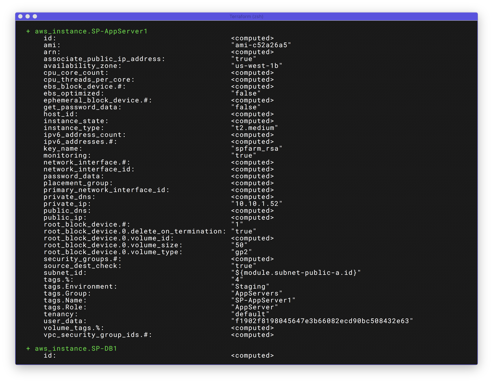

# Overview



Define infrastructure as code to increase operator productivity and transparency.  Now you're SharePoint Farm uses IaC.  Therefore, you can adopt the typical development workflow.




Terraform configuration can be stored in version control, shared, and collaborated on by teams of operators.

Most companies have more than one person managing their SharePoint Farm\(s\).  This approach enables for efficient, repeatable and reliable deployments and/or updates to a Farm Topology by more than one person.



If it is code, you can run it through a CI/CD Pipeline, no matter what build server you use.  It could be Jenkins, or a hosted service like Azure DevOps.  Whatever your organization is using.

\[INSERT CI/CD PIPELINE SAMPLE FOR SP FARM HERE\]



Since you are using a `source control` repository such as Git, GitHub, BitBucket; you are able to version your infrastructure and follow the typical `Developer Workflow` including submitting Pull Requests for changes to be reviewed prior to applying said changes.




Be a Hero at your company.


